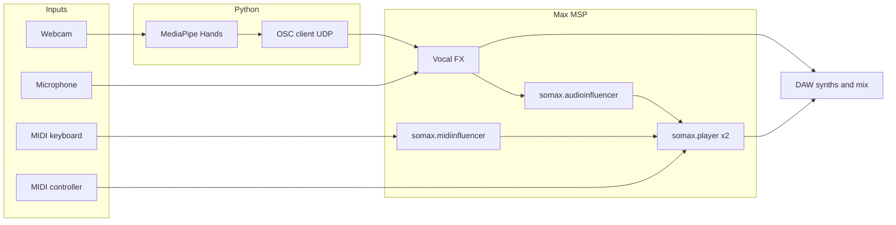

# Minotaur's Lament

Interactive **gesture-controlled vocal improvisation** with **[Somax2](https://www.ircam.fr/)**. **MediaPipe** hand tracking (Python) sends **OSC** to **Max/MSP**, where live vocals are processed and routed into Somax2’s **audio influencer**—so hand motion shapes what the AI hears and how it improvises.

The project name refers to a performance aesthetic grounded in **Greek mythology** (Minotaur, labyrinth) and **lament** traditions: solo voice, extended vocalisation, and an **atonal** Somax layer driven by **MIDI corpora** and DAW synths.

**Demo:** [Minotaur's Lament on YouTube](https://www.youtube.com/watch?v=s2owfob3t9w)

---

## Repository contents

| File | Purpose |
|------|---------|
| `hand_to_osc.py` | Single-hand MediaPipe tracking → OSC (`/hand_y`, `/hand_open`) |
| `face_to_osc.py` | Optional face landmarks → OSC (`/mouth_open`, `/right_eye`) for custom mappings |
| `minotaur's _lament.maxpat` | Max patch: OSC in, vocal processing, Somax2 players, audio/MIDI influencers |

Hand tracking is the main control path; `face_to_osc.py` is optional.

---

## Architecture

1. **Voice** — Microphone → Max → processed signal → Somax2 **audio influencer**.
2. **Gestures** — Webcam → Python (MediaPipe Hands) → OSC → Max (**frequency shift** and wet/dry mix).
3. **Somax2** — Two **players**: one follows **audio** (your processed voice), one follows **MIDI** (keyboard).
4. **MIDI controller** — e.g. **AKAI MIDImix** mapped to Somax2 parameters (influence weights, layer balance, output).
5. **DAW** — e.g. **Logic Pro** for virtual MIDI from Somax2 to instrument tracks and optional vocal FX (flanger, etc.).



---

## Requirements

### Software

- **Python 3**: `opencv-python`, `mediapipe`, `numpy`, `python-osc`
- **Cycling ’74 Max** (patch saved from Max **9**; confirm Somax2 works with your version)
- **Somax2** for Max (IRCAM)—`somax.player.app`, `somax.audioinfluencer.app`, `somax.midiinfluencer.app` must resolve on the Max search path
- **DAW** (optional but typical): Logic Pro or any host that can receive MIDI from Max and process vocals

### Hardware

- Webcam (1080p @ 30 fps works well)
- Audio interface with stable low-latency drivers
- **MIDI keyboard** for the second player / extra layer
- **MIDI controller** with knobs and faders (MIDImix-style layout fits the suggested mapping below)

---

## Installation

### Python

```bash
python3 -m venv .venv
source .venv/bin/activate   # Windows: .venv\Scripts\activate
pip install opencv-python mediapipe numpy python-osc
```

### Max / Somax2

Install Somax2 per IRCAM’s docs and ensure the package is on Max’s search path so embedded `bpatcher` objects load (`somax.player.app.maxpat`, etc.).

### Patch

Open **`minotaur's _lament.maxpat`**. Check:

- **`udpreceive`** on port **32000** (must match the Python scripts)
- Audio and MIDI routing to your interface and DAW

---

## OSC protocol

Python sends to **`127.0.0.1:32000`** over UDP.

### `hand_to_osc.py`

| Address | Range | Meaning |
|---------|-------|---------|
| `/hand_y` | 0–127 | Wrist height (landmark 0); middle **80%** of frame height used to reduce edge flicker; camera preview is mirrored |
| `/hand_open` | 0–127 | Thumb–index span (landmarks 4 & 8): **wide** ≈ high, **pinch** ≈ low |

Only **one hand** is tracked (`max_num_hands=1`). Values are integers **0–127** for easy scaling in Max (e.g. `/ 127.`).

### Vocal processing in Max

- Vertical hand position maps to roughly **−200 Hz … +200 Hz** frequency shift (see **`freqshift~`** in the patch).
- Output blends **dry** and **wet** paths; wet amount follows `/hand_open`. Target behaviour is **`Vout = 0.7 · Vin + g · Vwet`**—confirm gains in the patch for your setup.

### `face_to_osc.py` (optional)

| Address | Range | Meaning |
|---------|-------|---------|
| `/mouth_open` | 0–127 | Mouth opening from lip landmarks |
| `/right_eye` | 0–127 | Right-eye openness (inverted normalized aperture) |

Wire these only if you extend the Max patch.

---

## Somax2 setup

### Two players

- **Player 1 — Audio influencer:** listens to **gesture-processed vocals**. Hand motion changes spectral content Somax2 analyses (pitch, onset, chroma, MFCC, etc.).
- **Player 2 — MIDI influencer:** driven by **MIDI keyboard** for a second layer or foil.

**MIDI corpora** for both players pair cleanly with DAW virtual instruments while Somax2 handles structure and matching.

### Suggested AKAI MIDImix mapping

Group controls into three zones:

| Control | Somax2 parameter | Range |
|---------|------------------|--------|
| Knob 1 | Pitch (influence dimension) | {0, 1} |
| Knob 2 | Onset | {0, 1} |
| Knob 3 | Chroma | [0, 1] |
| Knob 4 | MFCC | [0, 1] |
| Knob 9 | Internal melodic match | [1, 128] |
| Knob 10 | Internal harmonic match | [1, 128] |
| Knob 11 | External melodic match | [1, 128] |
| Knob 12 | External harmonic match | [1, 128] |
| Fader 1 | Timeout | {0, 1} |
| Fader 2 | Continuity | [0, 127] |
| Fader 3 | Quality | [0, 1] |
| Fader 4 | Probability | [0, 1] |

Knobs **1–4** weight audio features from your voice. Knobs **9–12** balance **internal vs external** melodic/harmonic influence—how strongly **gesture-shaped pitch** steers the player. Faders adjust phrase behaviour and density. Recreate this in Max’s MIDI routing or learn to match your controller.

---

## Running a session

1. Set up **audio** (mic, headphones, lowest stable buffer—see troubleshooting).
2. Load **corpora** in Somax2 and wire influencers as in the patch.
3. Open the **Max** patch, enable DSP, verify OSC and **`freqshift~`** routing.
4. Run **`python hand_to_osc.py`** — preview shows Y and Open; **Esc** quits.
5. **Gesture:** hand **up/down** for shift; **thumb–index** for wet level.
6. Play **MIDI** for player 2; tweak **MIDImix** (or your mapping).
7. In the **DAW**, route Somax MIDI to synths; add vocal FX if you like (e.g. flanger for space).

---

## Artistic notes

- **Minotaur** — low, animal-like vocality; frequency shift widens range toward “roar” or strained lament.
- **Labyrinth** — fragmented phrasing, pauses (they affect onset detection), evolving Somax layers.
- **Lament** — solo, often wordless improvisation; melismatic and microtonal inflections fit the style.

---

## Design notes

- Gesture control tends to feel **more immediate** than voice-only Somax2 sessions because **processing changes** what the audio influencer hears.
- **Pitch-shifted / processed** input usually produces **more varied** Somax2 triggering than dry voice alone—worth experimenting with influence knob settings.

---

## Troubleshooting

| Issue | What to try |
|-------|-------------|
| Latency | Smaller buffer; lighter CPU/GPU load; wired audio |
| Too much to control solo | **Foot controllers** for Somax parameters; simplify mappings |
| OSC dead | Same port **32000** in Python and Max; allow UDP on localhost; check **OSC-route** for `/hand_y`, `/hand_open` |
| Wrong camera | Change `cv2.VideoCapture(0)` to `1`, `2`, … |
| Somax patchers missing | Reinstall Somax2; check Max **File Preferences** / search path |

---

## Acknowledgments

**Tilemachos Moussas** — kinesthesis-based gesture control with Somax2 in theatrical contexts.

---

## Citation

If you reference this project academically:

**Pingan Yao**, “An Interactive System for Gesture-Controlled Vocal Improvisation with Somax2: Cultural Narrative in Minotaur’s Lament,” *Sound and Music Computing (SMC)*, 2026.

---

## License

See **`LICENSE`** in the repository if provided. For the accompanying SMC article, check the publisher’s terms (open access CC BY where applicable).

---

## See also

- [Somax2 / IRCAM](https://www.ircam.fr/)
- [MediaPipe Hands](https://google.github.io/mediapipe/solutions/hands.html)
