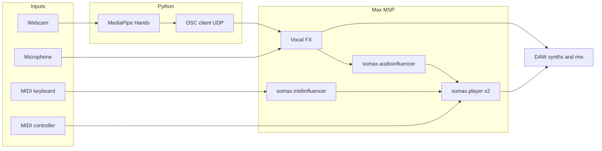

# Minotaur's Lament

**Minotaur's Lament** is an interactive system for **gesture-controlled vocal improvisation with [Somax2](https://www.ircam.fr/)**. Hand gestures captured with **MediaPipe** (Python) drive live vocal processing in **Max/MSP** via **Open Sound Control (OSC)**. The processed voice feeds Somax2's **audio influencer**, so gesture—not only timbre and harmony—actively shapes the AI's corpus-based generation.

The work situates this pipeline in a **culturally grounded performance**: Greek mythology (Minotaur, labyrinth) and **Ancient Greek lament** traditions (solo vocal mourning, heightened gesture) inform the aesthetic; Somax2 layers an **atonal, labyrinthine** MIDI corpus through synthesizers in a DAW.

This repository contains the **Python → OSC** trackers and the **Max 9** patch used in the research. For the academic framing, system evaluation, and bibliography, see the paper cited below.

---

## Demonstration

Video of a live improvisation using Somax2 with gesture control: **[Minotaur's Lament on YouTube](https://www.youtube.com/watch?v=s2owfob3t9w)**.

---

## Publication

If you use this project or cite the performance system, please reference:

**Pingan Yao**, “An Interactive System for Gesture-Controlled Vocal Improvisation with Somax2: Cultural Narrative in Minotaur’s Lament,” *Sound and Music Computing (SMC)*, 2026 (Paper 43).

Open access (CC BY 3.0). Source code for this research: [github.com/pinganyao/minotaurs-lament](https://github.com/pinganyao/minotaurs-lament).

---

## What’s in this repository

| File | Role |
|------|------|
| `hand_to_osc.py` | **Primary control path**: single-hand MediaPipe tracking → OSC (`/hand_y`, `/hand_open`) |
| `face_to_osc.py` | **Optional**: face mesh landmarks → OSC (`/mouth_open`, `/right_eye`) for experiments or alternate mappings |
| `minotaur's _lament.maxpat` | Max/MSP patch: OSC in, vocal processing, Somax2 players, audio/MIDI influencers |

The paper focuses on **hand** tracking; `face_to_osc.py` is provided as an additional starting point for face-driven control.

---

## System architecture (overview)

At a high level, the performer combines:

1. **Voice** — microphone into Max; processed and sent to Somax2’s audio influencer.
2. **Hand gestures** — webcam → Python (MediaPipe Hands) → OSC → Max (pitch/frequency shift and wet gain).
3. **Somax2** — two **players**: one influenced by **audio** (gesture-shaped vocals), one by **MIDI** (keyboard).
4. **Hardware MIDI** — e.g. **AKAI MIDImix** mapped to Somax2 parameters (influence dimensions, layer balance, output).
5. **DAW (e.g. Logic Pro)** — receives vocals (optionally with effects such as flanger) and **virtual MIDI** from Somax2 for synthesizer tracks.



---

## Prerequisites

### Software

- **Python 3** with:
  - `opencv-python`
  - `mediapipe`
  - `numpy`
  - `python-osc`
- **Cycling ’74 Max** (patch saved from **Max 9**; newer versions may open it—verify Somax2 compatibility).
- **Somax2** for Max (IRCAM)—including `somax.player.app`, `somax.audioinfluencer.app`, `somax.midiinfluencer.app` subpatchers referenced in this patch.
- **Digital Audio Workstation** (performance used **Logic Pro**) for synth voices and optional vocal FX—adapt if you use another DAW.

### Hardware (as in the paper)

- Webcam (**1080p @ 30 fps** used in tests).
- Audio interface with low-latency drivers.
- Optional but recommended for the described workflow: **MIDI keyboard** (player 2 influence + extra part), **AKAI MIDImix** (or similar) for Somax2 parameter control.

---

## Installation

### 1. Python environment

From the repository root:

```bash
python3 -m venv .venv
source .venv/bin/activate   # Windows: .venv\Scripts\activate
pip install opencv-python mediapipe numpy python-osc
```

### 2. Max / Somax2

Install Somax2 according to IRCAM’s instructions and ensure its package files are on Max’s search path so the patch’s `bpatcher` objects resolve (`somax.player.app.maxpat`, etc.).

### 3. Open the patch

Open **`minotaur's _lament.maxpat`** in Max. Confirm:

- **UDP receive** on port **32000** (matches the Python scripts).
- Audio/MIDI routing to your interface and, if applicable, to your DAW.

---

## Gesture parameters and OSC protocol

The Python client sends to **`127.0.0.1:32000`** (localhost).

### `hand_to_osc.py` (main path)

| OSC address | Range | Meaning |
|-------------|-------|---------|
| `/hand_y` | 0–127 | **Vertical hand position** from the wrist (landmark 0). Uses the **middle 80%** of the frame height to reduce edge jitter; mirrored video for natural left-right interaction. |
| `/hand_open` | 0–127 | **Thumb–index span** (landmarks 4 and 8): Euclidean distance in normalized image space, mapped so **wide spread ≈ high value**, **pinch ≈ low value**. (The paper refers to this as *pinch distance* with inverted numeric mapping to the same gesture.) |

Implementation notes:

- Only **one hand** is tracked (`max_num_hands=1`) so the non-gesture hand does not disturb the stream.
- Values are sent as **integers 0–127** for straightforward scaling inside Max (e.g. divide by 127. for 0–1).

### Max patch: vocal processing

The paper describes:

- **Frequency shift** of approximately **−200 Hz to +200 Hz** driven by vertical hand position.
- **Composite output**: clean voice plus wet pitch-shifted voice, with the wet path scaled by the pinch/open parameter (paper: \(V_{\mathrm{out}} = 0.7 V_{\mathrm{in}} + g \cdot V_{\mathrm{wet}}\)).

The bundled patch implements processing with Max objects such as **`freqshift~`** (see the patch for exact routing). Always verify levels and latency on your machine.

### `face_to_osc.py` (optional)

| OSC address | Range | Meaning |
|-------------|-------|---------|
| `/mouth_open` | 0–127 | Mouth opening derived from lip landmarks |
| `/right_eye` | 0–127 | Right-eye openness (inverted normalized eye aperture) |

Wire these in Max only if you extend the patch to use them.

---

## Somax2 layout (conceptual)

### Two players

- **Player 1 — Audio influencer**: listens to the **gesture-processed vocal** stream. This is the main feedback loop: moving your hand changes the spectral/temporal content Somax2 reacts to (pitch, onset, chroma, MFCC, etc.).
- **Player 2 — MIDI influencer**: driven by **MIDI keyboard** input so you can seed or steer a second layer.

Using **MIDI corpora** for both players (as in the paper) lets you shape timbre in the DAW with virtual instruments while keeping Somax2’s structure.

### AKAI MIDImix mapping (from the paper)

Hardware controls were grouped into three zones:

| Control | Somax2 parameter | Typical range |
|---------|------------------|----------------|
| Knob 1 | Pitch (influence dimension) | {0, 1} |
| Knob 2 | Onset | {0, 1} |
| Knob 3 | Chroma | [0, 1] |
| Knob 4 | MFCC | [0, 1] |
| Knob 9 | Internal melodic match | [1, 128] |
| Knob 10 | Internal harmonic match | [1, 128] |
| Knob 11 | External melodic match | [1, 128] |
| Knob 12 | External harmonic match | [1, 128] |
| Fader 1 | Timeout | {0, 1} |
| Fader 2 | Continuity | [0, 127] |
| Fader 3 | Quality | [0, 1] |
| Fader 4 | Probability | [0, 1] |

Knobs **1–4** weight how much each **audio feature** of your voice affects matching. Knobs **9–12** balance **internal vs external** melodic/harmonic influence—critical for how strongly **gesture-driven pitch material** steers the player. Faders tune **phrase length**, **continuity**, **match strictness**, and **density**.

Replicate this mapping in Max’s MIDI learn / routing to match your installation.

---

## Step-by-step: running a session

1. **Audio** — Connect mic and headphones; set buffer size as low as stable for your CPU (see *Troubleshooting*).
2. **Somax2** — Load your **corpora** into each player (MIDI corpora if following the paper’s synth workflow); configure influencers as in the patch.
3. **Max** — Open `minotaur's _lament.maxpat`; enable DSP; confirm OSC **udpreceive 32000** and routing to **`freqshift~`** / mixer matches your desired gains.
4. **Python** — Run `python hand_to_osc.py`; a window shows the camera feed with **Y** and **Open** values. Press **Esc** to quit.
5. **Gesture** — Move one hand vertically for **pitch/frequency shift**; open and close thumb and index for **wet level** (expressivity and timbral variation fed to Somax2).
6. **MIDI** — Use the keyboard for player 2; adjust **MIDImix** (or your mapping) to sculpt responsiveness and density.
7. **DAW** — Route Somax2 MIDI to instrument tracks; optionally process vocals (e.g. **flanger** for labyrinthine width, as in the performance).

---

## Artistic context (short)

- **Minotaur** — Mythological hybrid figure; voice imagined as low, animal-like; **pitch shift** extends range toward “roar” or heightened lament.
- **Labyrinth** — Nonlinear, fragmented navigation mirrored by **evolving vocals**, **pauses** (affecting onset detection), and **Somax2 variability**.
- **Lament** — Solo, improvised vocal mourning (**góos**-like); often wordless extended vocalization; **melisma** and **microtonal** inflections in modern Greek lament traditions inform style.

The paper develops these threads with references to scholarship and reception history.

---

## Observations from the study

- Gesture control was reported as **engaging** and **more interactive** than typical Somax2-only setups for many participants.
- **Pitch-shifted** vs clean input increased **triggered events** and **variability** in Somax2 under controlled trials—gesture-mediated processing materially affects the agent.

---

## Troubleshooting

| Issue | Suggestions |
|-------|-------------|
| **Latency** (gesture ↔ sound or voice I/O) | Reduce audio buffer; simplify GPU/CPU load; close unnecessary apps; use wired audio if possible. |
| **Solo performance overload** | Hands + voice + keyboard + MIDImix is demanding; consider **foot controllers** for Somax parameters (noted in the paper). |
| **OSC not moving parameters** | Confirm Python and Max use the **same port (32000)** and firewall allows **UDP localhost**; check Max **OSC-route** for `/hand_y` and `/hand_open`. |
| **Camera index** | If `cv2.VideoCapture(0)` is wrong, try `1`, `2`, … for your OS device order. |
| **Somax2 bpatcher missing** | Install/update Somax2; verify Max file paths include the Somax package. |

---

## Acknowledgments

From the SMC paper: thanks to **Tilemachos Moussas** for foundational work on kinesthesis-based gesture control with Somax2 in Greek theatrical contexts.

---

## License

Academic use and attribution encouraged. The original article is open access under **Creative Commons Attribution 3.0 Unported**. For code licensing, see the repository’s `LICENSE` if present.

---

## See also

- [Somax2 / IRCAM](https://www.ircam.fr/) — documentation and technical reports on influencers and players.
- [MediaPipe Hands](https://google.github.io/mediapipe/solutions/hands.html) — landmark indices and model behavior.
